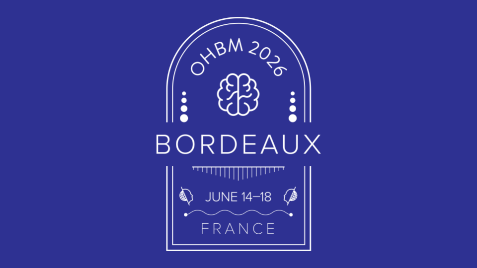

[](https://www.humanbrainmapping.org/)
# 🧠 OHBM 2026 Educational Course. Data harmonization for neuroscientific research: Theory, challenges, and applications.


## [Nicolás Nieto](https://github.com/N-Nieto)[✉️](n.nieto@fz-juelich.de), [Johanna Bayer](https://github.com/likeajumprope), [Gaurav Bhalerao](https://github.com/gvbhalerao591), [Emma Prevot](https://github.com/emmaprevot), [Jacob Turnbull](https://github.com/Jake-Turnbull).

[](https://www.ohbmbrainmapping.com/) [](https://jupyter.org/)
---

## 📋 Overview

Welcome to the official repository for the **OHBM 2026 Educational Course: Data harmonization for neuroscientific research: Theory, challenges, and applications.**. This course provides a comprehensive, hands-on journey from understanding the fundamental challenges of site effects in neuroimaging data to implementing state-of-the-art harmonization techniques.

---

### 🎯 Learning Objectives

By the end of this course, you will be able to:

- **Diagnose** site effects and batch artifacts in multi-site neuroimaging datasets
- **Implement** location-scale harmonization methods (ComBat, ComBat-GAM, CovBat)
- **Evaluate** harmonization quality using appropriate metrics and validation strategies
- **Handle** longitudinal and test-retest data with specialized techniques (Long-Combat, BART)
- **Integrate** harmonization into machine learning pipelines and statistical analyses
- **Apply** advanced alternatives including deep learning and normative modeling approaches

---

## 🗂️ Repository Structure

The course is organized into four progressive blocks, each containing interactive Jupyter notebooks, simulated datasets, and supplementary materials.

``` lua
📦 OHBM2026-harmonization-course
├── 📁 data/                                    # Simulated and example datasets
├── 📁 notebooks/                               # Jupyter notebooks by block
│   ├── 📁 block01/                             # BLOCK1: Effects of Site Introduction
│   │       ├──📁 block01_utils/                # Processing and visualization functions fro the block
│   │       ├── 🐍 B1_N1_name.ipynb             # Notebooks are organized by block (B) and by Notebook (N).
│   │        ...
│   │       └── 🐍 B1_NX_name.ipynb
│   ├── 📁 block02/                             # BLOCK2: Harmonization General
│   ├── 📁 block03/                             # BLOCK3: Location-Scale Methods
│   └── 📁 block04/                             # BLOCk4: Alternatives & Future Directions
├── 📁 solutions/                               # Solutions to exercises and questions
│   ├── 📁 block01/                            
│          ├── 📑 B1_N1_solution.ipynb/.md
            ...
           └── 📑 B1_NX_solution.ipynb/.md
│   ├── 📁 block02/                             
│   ├── 📁 block03/                             
│   └── 📁 block04/                             
├── 📄 requirements.txt                         # Python dependencies
└── 📄 Slides.pdf                               # Slide deck used in the presentation 

```

## Running the Notebooks on Binder.

We highly recommend to run the notebooks online without any local setup using Binder. This will allow us to rapidly jump to the content and avoid use time with particular-cases setups.

1.  **Click the badge** to launch the Binder environment:
    [](https://mybinder.org/v2/gh/N-Nieto/OHBM2026_Educational_course_harmonization/HEAD)

2.  **Wait for the environment to build.** This may take a few minutes. Binder is creating a live, interactive server with all the necessary packages and data pre-installed. If the environment exist, it will automatically connect.

3.  **Start exploring!** Once the Jupyter interface loads, navigate to the desired notebook (`*.ipynb` file) and click on it to open and run it.


[](https://humanbrainmapping.org/i4a/pages/index.cfm?pageid=4293)